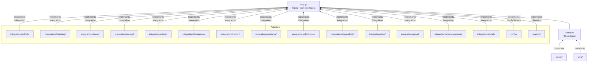
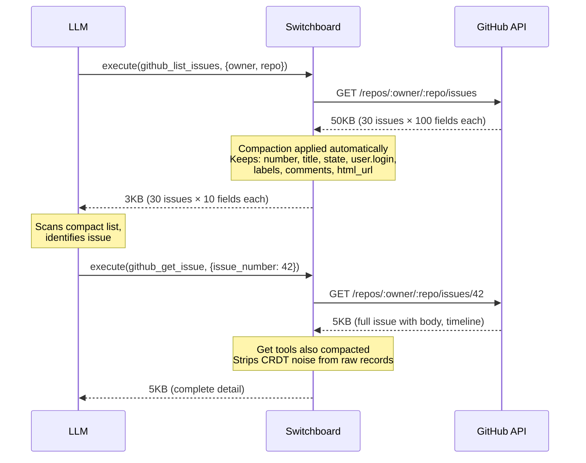

# AGENTS.md

## Overview

- Go MCP server aggregating GitHub, Datadog, Linear, Sentry, Slack, Metabase, Notion, AWS, PostHog, PostgreSQL, ClickHouse, pganalyze, RWX, Gmail, Home Assistant, YNAB, GCP behind one endpoint
- Two meta-tools only: **search** (discover operations) and **execute** (run them)
- Hexagonal architecture (ports and adapters)
- HTTP transport (streamable) + web config UI on same port

## Commands

| Target | Command | Make shortcut |
|--------|---------|---------------|
| Build | `go build -o switchboard ./cmd/server` | `make build` |
| Test | `go test ./...` | `make test` |
| Test + race | `go test -race -coverprofile=coverage.out ./...` | `make test-race` |
| Vet | `go vet ./...` | `make vet` |
| Lint | `go tool golangci-lint run` | `make lint` |
| Security scan | `go tool gosec -exclude=G101,G104,G115,G117,G119,G120,G304,G505,G704 ./...` | `make gosec` |
| Vuln check | `go tool govulncheck ./...` | `make govulncheck` |
| All security | gosec + govulncheck | `make security` |
| **All CI checks** | build + vet + test-race + lint + security | **`make ci`** |
| Generate templ | `go generate .` | `make generate` |
| Install | Build + copy to `~/.local/bin` + install systemd user service | `make install` |
| Deploy | Build + copy to `~/.local/bin` + restart systemd service | `make deploy` |
| Clean | `rm -f switchboard coverage.out` | `make clean` |

```bash
# Run (default — HTTP server with MCP + web UI on same port)
./switchboard
./switchboard --port 3847

# Run (stdio mode — legacy, for AI clients that need stdin/stdout)
./switchboard --stdio

# Daemon management
./switchboard daemon install              # Install as launchd (macOS) or systemd (Linux) service
./switchboard daemon uninstall            # Remove the system service
./switchboard daemon start                # Start the daemon (uses service if installed, else detached process)
./switchboard daemon start --port 9999    # Start on a custom port
./switchboard daemon stop                 # Stop the daemon
./switchboard daemon status               # Show daemon status + health
./switchboard daemon logs                 # Print log file path

# Release (local snapshot for testing)
goreleaser release --snapshot --clean

# Release (production — triggered by pushing a git tag)
git tag -a v0.1.0 -m "v0.1.0"
git push origin v0.1.0
# CI (or manually): goreleaser release --clean

# Generate templ templates (required after editing .templ files in web/templates/)
make generate
```

### Local Development Daemon (systemd only)

On Linux systems with systemd, `make install` and `make deploy` manage a user-space daemon for local development. The binary is **copied** (not symlinked) to `~/.local/bin/switchboard`, so the daemon keeps running even if the source worktree is deleted. **Note**: macOS users with launchd should use `./switchboard daemon install` directly — these Makefile targets are Linux-specific.

```bash
# First time — build, install binary, create systemd user service, and start
make install

# After code changes — build, overwrite binary, restart service
make deploy

# Logs and status
journalctl --user -u switchboard -f
systemctl --user status switchboard
```

The systemd unit file is written to `~/.config/systemd/user/switchboard.service` and points at `~/.local/bin/switchboard`. The service restarts on failure automatically.

- **Templ**: `web/templates/*.templ` → run `templ generate` after edits. **Never edit `*_templ.go`** (generated)
- **Release**: GoReleaser via `.goreleaser.yml`. Ldflags: `main.version`, `main.commit`, `main.date`
- **Testing**: `stretchr/testify` assertions. Tests in every package
- **Linting**: `.golangci.yml` — errcheck, govet, ineffassign, staticcheck, unused
- **CI**: `.github/workflows/ci.yml` — build, test (race), golangci-lint, gosec, govulncheck
- **Go 1.26** — deps: `go-sdk`, `go-github/v68`, `slack-go/slack`, `a-h/templ`, `lib/pq`, `clickhouse-go/v2`, `testify`

## Requirements Before Completing Code Changes

1. **Run `make ci`** — must pass (build, vet, test-race, lint, security)
2. **New code must include tests**
3. **TDD**: write failing test before implementation, verify it fails for the right reason, then write minimal code to pass
4. **Table-driven tests**: use `t.Run` subtests when 3+ cases share the same assert structure. Keep standalone tests for cases with unique setup or assertions
5. **MCP smoke test** — `TestSmoke_SearchResponseShape` in `server/server_test.go` validates the full response contract. Runs as part of `make test`.

## Git Workflow

- Branch from `main` for all changes
- CI runs on PRs to `main`: build, test (race detection), lint, gosec, govulncheck — all must pass
- Commit messages: descriptive subject line, imperative mood (e.g., "Add Linear OAuth flow", "Fix token refresh race condition")
- PRs should include tests for new functionality

## Commit Attribution

AI commits MUST include:
```
Co-Authored-By: <agent model name> <noreply@anthropic.com>
```

## Project Structure

```
mcp.go                       Domain types + port interfaces (the hexagonal core)
compact.go                   Field compaction engine — CompactJSON, ParseCompactSpecs, dot-notation parser
cmd/server/main.go           Composition root — wires adapters into Services, starts server + daemon subcommand
server/server.go             MCP server — exposes search/execute tools, routes to integrations, applies field compaction
config/config.go             ConfigService adapter — JSON file at ~/.config/switchboard/config.json
registry/registry.go         Registry adapter — thread-safe integration lookup
daemon/
  daemon.go                  Daemon management — PID file, health checks, process control, status
  launchd.go                 macOS launchd plist generation + launchctl commands
  systemd.go                 Linux systemd user unit generation + systemctl commands
  fallback.go                Platform dispatch + pure Go process detach fallback
  proc_unix.go               Unix-specific SysProcAttr (Setsid)
  proc_windows.go            Windows-specific SysProcAttr (CREATE_NO_WINDOW)
integrations/
  github/
    github.go                GitHub integration adapter (core, dispatch, helpers, FieldCompactionIntegration)
    compact_specs.go         Field compaction spec declarations (~45 list/search tools)
    tools.go                 GitHub tool definitions (~100 tools)
    repos.go                 Repos, releases, deploy keys, webhooks, rate limit handlers
    issues.go                Issues, comments, labels, milestones handlers
    pulls.go                 Pull requests, reviews, merge handlers
    git.go                   Low-level git (commits, refs, trees, tags) handlers
    users_orgs.go            Users, followers, orgs, teams handlers
    actions.go               Actions workflows, runs, jobs, secrets, checks handlers
    search.go                Search (code, issues, users, commits) handlers
    extras.go                Gists, activity, code/secret/dependabot scanning, copilot handlers
    oauth.go                 GitHub Device Flow OAuth (device code grant, polling, token exchange)
  datadog/
    datadog.go               Datadog integration adapter (core, dispatch, SDK client, helpers)
    tools.go                 Datadog tool definitions (~60 tools)
    logs.go                  Logs search and aggregation handlers
    metrics.go               Metrics query, search, metadata handlers
    monitors.go              Monitors CRUD, search, mute handlers
    dashboards.go            Dashboards list, get, create, delete handlers
    events.go                Events list, search, get, create handlers
    extras.go                Hosts, tags, SLOs, downtimes, incidents, synthetics,
                             notebooks, users, spans, software catalog, IP ranges handlers
  linear/
    linear.go                Linear integration adapter (core, dispatch, GraphQL helpers)
    tools.go                 Linear tool definitions (~60 tools)
    issues.go                Issues, comments, relations, labels, attachments handlers
    projects.go              Projects, project updates, milestones handlers
    teams.go                 Teams and users handlers
    extras.go                Cycles, labels, workflow states, documents, initiatives,
                             favorites, webhooks, notifications, templates, org,
                             custom views, rate limit handlers
    oauth.go                 Linear OAuth (PKCE authorization code flow, token exchange)
  sentry/
    sentry.go                Sentry integration adapter (core, dispatch, HTTP helpers)
    tools.go                 Sentry tool definitions (~55 tools)
    organizations.go         Organizations, members, teams, repos handlers
    issues.go                Projects, issues, events, tags, stats handlers
    releases.go              Releases, deploys, commits, files handlers
    extras.go                Alerts, monitors (cron), discover, replays handlers
    oauth.go                 Sentry Device Flow OAuth (device code grant, polling)
  slack/
    slack.go                 Slack integration adapter (core, dispatch, cookie transport, mutex-protected client)
    tokens.go                Token store (persistence, Chrome disk-read extraction via LevelDB+SQLite+AES, background refresh)
    tools.go                 Slack tool definitions (~42 tools)
    conversations.go         Channels, DMs, history, threads handlers
    messages.go              Send, update, delete, search, reactions, pins handlers
    users.go                 Users, user groups, presence handlers
    extras.go                Files, bookmarks, reminders, emoji, team info, auth handlers
    extract.go               Exported helpers for web UI token extraction (Chrome, manual, snippet)
    oauth.go                 Slack OAuth v2 (authorization code flow, callback handling)
    refresh.go               Cookie-based token refresh (fetches fresh xoxc via xoxd cookie HTTP request)
  metabase/
    metabase.go              Metabase integration adapter (core, dispatch, HTTP helpers)
    tools.go                 Metabase tool definitions (~22 tools)
    databases.go             Database, table, field metadata handlers
    queries.go               Native SQL query execution, card CRUD handlers
    dashboards.go            Dashboard CRUD, add-card-to-dashboard handlers
    collections.go           Collection CRUD, search handlers
  notion/
    notion.go                Notion v3 integration adapter (core, dispatch, HTTP helpers)
    tools.go                 Notion tool definitions (~24 tools)
    compact_specs.go         Field compaction spec declarations (13 read tools)
    data_sources.go          Database create, data sources read/update/query/templates handlers
    pages.go                 Pages CRUD, move, property + convenience (getPageContent, createPageWithContent) handlers
    blocks.go                Blocks CRUD, children list/append handlers
    search.go                Search handler (normalized results + recordMap merge)
    users.go                 Users list, retrieve, get-self handlers
    comments.go              Comments create, retrieve handlers
    recordmap.go             recordMap extraction helpers (extractRecord, extractAllRecords)
    transaction.go           submitTransaction builder helpers (buildOp, buildTransaction)
  aws/
    aws.go                   AWS integration adapter (core, dispatch, typed SDK clients, helpers)
    tools.go                 AWS tool definitions (~65 tools)
    sts.go                   STS caller identity handler
    s3.go                    S3 buckets, objects CRUD, copy, head handlers
    ec2.go                   EC2 instances, security groups, VPCs, subnets, volumes, addresses handlers
    lambda.go                Lambda functions, invoke, event source mappings handlers
    iam.go                   IAM users, roles, policies, groups, attached policies handlers
    cloudwatch.go            CloudWatch metrics, metric data, alarms, statistics handlers
    ecs.go                   ECS clusters, services, tasks, task definitions handlers
    sns.go                   SNS topics, subscriptions, publish handlers
    sqs.go                   SQS queues, messages, send/receive/delete handlers
    dynamodb.go              DynamoDB tables, items CRUD, query, scan handlers
    cloudformation.go        CloudFormation stacks, resources, templates, events handlers
  posthog/
    posthog.go               PostHog integration adapter (core, dispatch, HTTP helpers)
    tools.go                 PostHog tool definitions (~50 tools)
    projects.go              Projects CRUD handlers
    feature_flags.go         Feature flags CRUD, activity handlers
    cohorts.go               Cohorts CRUD, persons-in-cohort handlers
    insights.go              Insights (trends, funnels) CRUD handlers
    persons.go               Persons, groups, property management handlers
    extras.go                Annotations, dashboards, actions, events, experiments, surveys handlers
  postgres/
    postgres.go              PostgreSQL integration adapter (core, dispatch, sql.DB helpers)
    tools.go                 PostgreSQL tool definitions (~25 tools)
    databases.go             Schema discovery, table/column/index/constraint/view/function/trigger/enum handlers
    queries.go               Query execution, EXPLAIN, SELECT builder, read-only transaction wrappers
    management.go            Database info, size, stats, roles, grants, extensions, connections, locks handlers
  clickhouse/
    clickhouse.go            ClickHouse integration adapter (core, dispatch, native driver helpers)
    tools.go                 ClickHouse tool definitions (~20 tools)
    queries.go               SQL query execution, EXPLAIN handlers
    databases.go             Database, table, column metadata handlers
    extras.go                System info, processes, merges, replicas, disk usage,
                             parts, dictionaries, users, roles, query log handlers
  pganalyze/
    pganalyze.go             pganalyze integration adapter (core, dispatch, GraphQL helpers)
    compact_specs.go         Field compaction spec declarations
    tools.go                 pganalyze tool definitions (~3 tools)
    servers.go               Server listing handler
    issues.go                Issue listing handler
    queries.go               Query statistics handler
  rwx/
    rwx.go                   RWX integration adapter (core, dispatch, HTTP helpers, proxy client)
    tools.go                 RWX tool definitions (~11 tools + dynamic proxy tools)
    runs.go                  CI run listing and detail handlers
    logs.go                  Run log retrieval and caching handlers
    extras.go                Workspaces, branches, suites handlers
    proxy.go                 Proxy client for rwx mcp serve (dynamic tool forwarding)
  gmail/
    gmail.go                 Gmail integration adapter (core, dispatch, HTTP helpers, OAuth2 refresh)
    compact_specs.go         Field compaction spec declarations (~9 list tools)
    tools.go                 Gmail tool definitions (~44 tools)
    messages.go              Message CRUD, send, trash, labels handlers
    threads.go               Thread list, get, trash, labels handlers
    labels.go                Label CRUD handlers
    drafts.go                Draft CRUD, send handlers
    settings.go              Filters, forwarding, send-as, delegates, vacation handlers
    oauth.go                 Gmail OAuth2 (authorization code flow, token refresh)
  homeassistant/
    homeassistant.go         Home Assistant integration adapter (core, dispatch, HTTP helpers)
    compact_specs.go         Field compaction spec declarations
    tools.go                 Home Assistant tool definitions (~17 tools)
    states.go                Entity state listing and detail handlers
    services.go              Service domain and call handlers
    history.go               Entity history handlers
    events.go                Event firing and listening handlers
    extras.go                Config, areas, devices, entities, templates, logs handlers
  ynab/
    ynab.go                  YNAB integration adapter (core, dispatch, HTTP helpers, FieldCompactionIntegration)
    compact_specs.go         Field compaction spec declarations (~10 list tools)
    tools.go                 YNAB tool definitions (~25 tools)
    budgets.go               User, budgets, budget settings, accounts handlers
    categories.go            Categories, payees, months handlers
    transactions.go          Transactions, scheduled transactions handlers
gcp/
  gcp.go                     GCP integration adapter (core, dispatch, typed SDK clients, helpers)
  tools.go                   GCP tool definitions (~55 tools)
  resourcemanager.go         Projects, folders, IAM policy handlers
  storage.go                 Cloud Storage buckets, objects CRUD, copy handlers
  compute.go                 Compute Engine instances, disks, networks, subnetworks, firewalls handlers
  functions.go               Cloud Functions list, get, IAM policy handlers
  iam.go                     IAM service accounts, keys, roles handlers
  monitoring.go              Cloud Monitoring metrics, time series, alert policies handlers
  run.go                     Cloud Run services, revisions handlers
  pubsub.go                  Pub/Sub topics, subscriptions, publish, pull handlers
  firestore.go               Firestore collections, documents CRUD, query handlers
  logging.go                 Cloud Logging entries, log names, sinks handlers
web/
  web.go                     Web UI HTTP server for config dashboard + Slack token setup routes
  templates/                 Templ-based templates — do not edit *_templ.go (generated)
    layouts/                 Base layout templates
    pages/                   dashboard, integrations_list, integration detail,
                             github_setup, linear_setup, sentry_setup, slack_setup, notion_setup
    components/              Shared UI components
```

## Architecture

### Hexagonal Pattern

The root package is `package mcp` (not `switchboard`, despite the module name). Import as:
```go
mcp "github.com/daltoniam/switchboard"
```

Defines domain types and port interfaces. Adapters satisfy interfaces. Dependencies point inward.


```mermaid
graph BT
    subgraph "Adapters"
        GH["integrations/github/"] & DD["integrations/datadog/"] & LN["integrations/linear/"]
        SN["integrations/sentry/"] & SL["integrations/slack/"] & MB["integrations/metabase/"]
        NT["integrations/notion/"] & PG["integrations/postgres/"] & CH["integrations/clickhouse/"]
        PA["integrations/pganalyze/"] & RW["integrations/rwx/"] & GM["integrations/gmail/"]
        HA["integrations/homeassistant/"] & YN["integrations/ynab/"]
        CF["config/"] & RG["registry/"]
    end

    GH & DD & LN & SN & SL & MB & NT & PG & CH -->|implements\nIntegration| Core
    PA & RW & GM & HA & YN -->|implements\nIntegration| Core
    CF -->|implements\nConfigService| Core
    RG -->|implements\nRegistry| Core

    Core["mcp.go\n(types + port interfaces)"]

    SRV["server/"] & WEB["web/"] -->|consumes| DI["Services\n(DI container)"]
    DI --> Core
```

**Core (`mcp.go` + `compact.go`)**:
- Types: `Config`, `Credentials`, `IntegrationConfig`, `ToolDefinition`, `ToolResult`, `HealthStatus`, `CompactField`
- Port interfaces: `Integration`, `ConfigService`, `Registry`
- Opt-in interface: `FieldCompactionIntegration` — adapters implement to declare field compaction specs
- DI container: `Services` struct

**Adapters** (each implements a port interface):
- `integrations/github/`, `integrations/datadog/`, `integrations/linear/`, `integrations/sentry/`, `integrations/slack/`, `integrations/metabase/`, `integrations/notion/`, `integrations/aws/`, `integrations/posthog/`, `integrations/postgres/`, `integrations/clickhouse/`, `integrations/pganalyze/`, `integrations/rwx/`, `integrations/gmail/`, `integrations/homeassistant/`, `integrations/ynab/`, `gcp/` → `Integration`
- `config/` → `ConfigService`
- `registry/` → `Registry`
- `server/` → MCP server (consumes `Services`)
- `web/` → Web UI server (consumes `Services`)

### Search/Execute Pattern

| MCP Tool | Purpose |
|----------|---------|
| `search` | Discover tools across enabled integrations. Filter by name, integration, keyword. Returns `ToolDefinition`s |
| `execute` | Run a tool by name with arguments. Routes to correct adapter |

**Flow:**
1. `search({"query": "github issues"})` → tool definitions with parameter schemas
2. `execute({"tool_name": "github_list_issues", "arguments": {"owner": "golang", "repo": "go"}})` → results

## Key Interface: `Integration`

Every integration adapter implements this interface defined in `mcp.go`:

```go
type Integration interface {
    Name() string
    Configure(ctx context.Context, creds Credentials) error
    Tools() []ToolDefinition
    Execute(ctx context.Context, toolName string, args map[string]any) (*ToolResult, error)
    Healthy(ctx context.Context) bool
}
```

- **`Name()`** — Lowercase identifier (e.g., `"github"`). Must match config key.
- **`Configure(ctx)`** — Receives `context.Context` and `Credentials` (`map[string]string`). Validate and store. I/O adapters propagate ctx.
- **`Tools()`** — Returns tool definitions for progressive discovery via the `search` MCP tool.
- **`Execute()`** — Dispatches to the correct handler by tool name. Returns `*ToolResult`.
- **`Healthy()`** — Lightweight API call to verify credentials.

## Other Port Interfaces

```go
type ConfigService interface {
    Load() error
    Save() error
    Get() *Config
    Update(cfg *Config) error
    GetIntegration(name string) (*IntegrationConfig, bool)
    SetIntegration(name string, ic *IntegrationConfig) error
    EnabledIntegrations() []string
}

type Registry interface {
    Register(i Integration) error
    Get(name string) (Integration, bool)
    All() []Integration
    Names() []string
}
```

## Services Struct (DI Container)

```go
type Services struct {
    Config   ConfigService
    Registry Registry
}
```

Constructed in `cmd/server/main.go` and passed to both `server.New()` and `web.New()`.

## Adding a New Integration

1. Create `integrations/<name>/<name>.go`.
2. Define an unexported struct implementing `Integration`.
3. Export a `New()` constructor that returns `mcp.Integration`.
4. In `Tools()`, return `[]mcp.ToolDefinition` describing each operation.
5. In `Execute()`, switch on tool name and dispatch to private handler methods.
6. Register in `cmd/server/main.go` by adding to the integration list.
7. Add default credentials to `config.defaultConfig()` in `config/config.go`.
8. Add env var mappings for the new integration's credentials to `envMapping` in `config/config.go`.
9. Update the **Environment Variables** table in `README.md` with the new env var names.

## Conventions and Patterns

### Unexported Structs, Exported Constructors
```go
type github struct { ... }           // unexported
func New() mcp.Integration { ... }   // returns interface
```

### Import Aliases

Only `slack`, `aws`, `notion`, and `gcp` require aliases to avoid collision with standard/SDK package names. Other packages are imported directly.

| Package | Alias | Used In |
|---------|-------|---------|
| `github.com/daltoniam/switchboard` | `mcp` | All consumers |
| `.../switchboard/integrations/slack` | `slackInt` | `cmd/server/main.go`, `web/web.go` |
| `.../switchboard/integrations/aws` | `awsInt` | `cmd/server/main.go` |
| `.../switchboard/integrations/notion` | `notionInt` | `cmd/server/main.go` |
| `.../switchboard/integrations/github` | `ghInt` | `web/web.go` |
| `.../switchboard/integrations/linear` | `linearInt` | `web/web.go` |
| `.../switchboard/integrations/sentry` | `sentryInt` | `web/web.go` |
| `.../switchboard/gcp` | `gcpInt` | `cmd/server/main.go` |

### Tool Naming
Tools are prefixed with integration name: `github_search_repos`, `datadog_search_logs`, `linear_list_issues`, `sentry_list_issues`.

### Argument Parsing
Each adapter has a local `argStr` helper:
```go
func argStr(args map[string]any, key string) string {
    v, _ := args[key].(string)
    return v
}
```

### Dispatch Map Test Parity

Every adapter **must** have two tests enforcing bidirectional parity between `Tools()` definitions and the `dispatch` map:

- `TestDispatchMap_AllToolsCovered` — every tool returned by `Tools()` has a handler in `dispatch`
- `TestDispatchMap_NoOrphanHandlers` — every key in `dispatch` has a corresponding `ToolDefinition`

When adding a new tool: add both the `ToolDefinition` in `tools.go` **and** the handler entry in the `dispatch` map. Tests will fail if either is missing.

### Field Compaction

A whitelist of fields, per tool, that the MCP server uses to build a DTO before sending to the MCP client. Optimize specs for fewest total tokens across the entire task workflow, not smallest single response.


```mermaid
sequenceDiagram
    participant LLM
    participant Switchboard
    participant API as GitHub API

    LLM->>Switchboard: execute(github_list_issues, {owner, repo})
    Switchboard->>API: GET /repos/:owner/:repo/issues
    API-->>Switchboard: 50KB (30 issues × 100 fields each)
    Note over Switchboard: Compaction applied automatically<br/>Keeps: number, title, state, user.login,<br/>labels, comments, html_url
    Switchboard-->>LLM: 3KB (30 issues × 10 fields each)

    Note over LLM: Scans compact list,<br/>identifies issue #42

    LLM->>Switchboard: execute(github_get_issue, {issue_number: 42})
    Switchboard->>API: GET /repos/:owner/:repo/issues/42
    API-->>Switchboard: 5KB (full issue with body, timeline)
    Note over Switchboard: Get tools also compacted<br/>Strips CRDT noise from raw records
    Switchboard-->>LLM: 5KB (complete detail)
```

- **Opt in**: Implement `CompactSpec(toolName string) ([]CompactField, bool)` — returns parsed fields + found flag
- **Declare specs** in `<adapter>/compact_specs.go` using dot-notation: `"title"`, `"user.login"`, `"labels[].name"`, `"page.id"` (2+ specs sharing a root → nested object)
- **Spec syntax** (all parsed by `ParseCompactSpecs` in `compact.go`):
  - `"field"` — keep a top-level field
  - `"parent.child"` — extract nested value (2+ children sharing a root → nested object in output)
  - `"parent[].child"` — extract from array elements
  - `"-field"` — exclude a top-level field (exclusion mode: all other fields kept)
  - `"-parent.child"` — exclude the entire parent object
  - `"field:alias"` — rename field in output
  - `"parent.*"` — wildcard, keeps entire sub-object under parent key (one level only)
- **Omitempty**: null values and empty objects `{}` are stripped from compacted output. Empty arrays `[]` in spec-targeted array groups are preserved — a spec targeting `matches[]` means `[]` is a meaningful "0 results" signal, not noise
- **Pre-computed field plans**: `buildFieldPlan` groups specs into scalars, array groups, object groups, wildcards, and excludes once per `CompactJSON` call — shared across all array items
- **Keep**: fields that prevent N+1 drill-downs (routing fields, identifiers, states, dates, counts)
- **Drop**: nested full objects (user, repo), permissions, avatars, node_ids, template URLs
- **Compact all reads**: any tool returning raw API records (list, search, or single-record get) needs a compaction spec. Mutation tools return small confirmation objects (`{"id":"...","status":"updated"}`) — no spec needed.
- **Handler boundary**: handlers do structural transformation only (unwrap envelopes, merge split responses, tree-build). All noise/context reduction flows through compaction specs — handler-level field whitelists or record filtering cause spec drift (changes require two-file edits, reviewers miss the handler's hidden filter).
- **Dispatch parity**: `TestFieldCompactionSpecs_NoOrphanSpecs` — every spec key must have a dispatch handler
- **Shape parity**: spec paths must match the handler's actual output structure, not the assumed upstream API structure. A spec targeting `messages.matches[]` when the handler returns flat `{"matches": [...]}` extracts nothing → `{}`. Verify: trace each spec root key to the handler's `jsonResult()` / `rawResult()` call — every spec root must exist as a key in the handler output
- **GraphQL envelope awareness**: GraphQL handlers return `{"queryName": {"nodes": [...]}}` via `rawResult(gqlResp.Data)`. Specs must include the envelope path: `"issues.nodes[].id"`, not `"id"`
- **Compaction spec tests**: every adapter with `compact_specs.go` has a `compact_specs_test.go` with 7-8 tests: no orphan specs, no missing specs for read tools, no specs on mutation tools, spec parsability, nested object grouping, wildcard consistency, **shape parity** (compaction of a representative handler output produces non-empty result)
- **Unwrap SDK lists**: return `resp.Items` not `resp` so compaction operates on the array directly
- **Anti-pattern**: `return jsonResult(fullSDKWrapper)` for list tools
- **Benchmarks**: `BenchmarkCompactionRatio` in `compact_test.go` — 8 sub-benchmarks with realistic payloads (GitHub, Datadog, Linear, Sentry, AWS, exclusion, single object, passthrough). Reports input_bytes, output_bytes, savings_%, throughput MB/s.
- **Glob exclusion specs**: `"-*_url"` removes all fields matching the glob pattern. Only valid in exclusion mode (prefix `-`). Uses `path.Match` semantics. Validated at parse time — invalid patterns (e.g., `"-[invalid"`) rejected by `ParseCompactSpecs`. **Caveat**: glob catches future fields too — `"-*_url"` will silently exclude any new `*_url` field an upstream API adds. Use targeted exclusions when the field set is small and stable.
- See `.claude/skills/optimize-integration/SKILL.md` for compaction refinement, handler boundary rules, and anti-patterns

### Columnar JSON Format

Arrays of 8+ objects in execute/search responses are automatically reshaped to columnar format, eliminating per-record key repetition. Applied at the MCP response boundary (`columnarizeResult` in `server/server.go`).

```json
// Per-record (< 8 items): [{...},{...}]
// Columnar (8+ items):
{"columns":["id","title","state"],"rows":[[1,"bug","open"],[2,"feat","closed"]],"constants":{"repo":"myrepo"}}
```

- **Constant lifting**: Columns where all values are identical (via `reflect.DeepEqual`) move to `"constants"` map and are removed from columns/rows
- **Density ordering**: Columns sorted by non-null count descending, alphabetical tiebreak — dense (important) columns appear first
- **Threshold**: `columnarMinItems = 8` in `compact.go`. Below 8, per-record format preserved for readability. At 8+, columnar saves 28%+ even on heterogeneous data. Applied to all non-error responses (execute, search, scripts) — mutation tools are unaffected because they return single objects, not arrays
- **Nested arrays**: `columnarizeNestedArrays` also converts nested `[]map[string]any` inside objects (e.g., `issues.nodes[]` inside a GraphQL envelope)
- **Implementation**: `buildColumnar` in `compact.go` — single function used by both top-level and nested array columnarization
- **Safe for LLMs**: Validated on Haiku, Sonnet, and o3 — all parse columnar format correctly

### Search Response Optimizations

Search responses (`handleSearch` in `server/server.go`) apply two additional optimizations:

- **Shared parameter deduplication**: Parameters with identical name+description across 3+ tools in the page are extracted to a top-level `shared_parameters` map and removed from per-tool `parameters`. Common params like `"owner": "Repository owner"` appear once instead of N times. Ambiguous names (same name, different descriptions) stay per-tool.
- **Search columnarization**: The `tools` array is columnarized (8+ results). Combined with constant lifting, single-integration searches get `constants: {"integration": "github"}`.
- **CRITICAL: deep-copy Parameters before mutation** — `searchToolInfo.Parameters` must be a fresh map, not a pointer to the integration's original `ToolDefinition.Parameters`. The `extractSharedParameters` function deletes keys from the map. Without the deep copy, searches progressively corrupt the integration's tool definitions.

### Script Field Projection

Scripts can project fields from `api.call()` / `api.tryCall()` results via an optional third argument:

```javascript
var issues = api.call("github_list_issues", {owner:"org",repo:"app"}, {fields:["number","title"]});
// issues = [{number:1,title:"bug"},{number:2,title:"feat"}] — only requested fields
```

- Third arg is optional — omitting it preserves existing behavior (full compacted result)
- `fields` array parsed as compact specs via `ParseCompactSpecs` → applied via `CompactJSON` before JS parsing
- Compaction happens after the integration's own compaction (additive filtering, never expands)
- Implementation: `parseCallArgs` returns 3 values, `projectFields` in `script/engine.go`

### Tool Description Design

Tool descriptions are the only context an LLM gets for tool selection. Design for correct routing:

- **Workflow entry points**: "Start here for most workflows"
- **Prefer-over hints**: "Preferred over retrieve_page — returns the full page tree"
- **Gotcha prevention**: surface ID/parameter confusion in description AND parameter strings
- **Tiers**: high-value tools get routing hints, supporting tools get chaining hints, subsumed primitives get prefer-over hints
- See `.claude/skills/optimize-integration/SKILL.md` for the full optimization workflow

### Error Handling
- Integration errors: return `&mcp.ToolResult{Data: err.Error(), IsError: true}, nil`
- Only return a non-nil Go error for truly exceptional failures
- The server layer wraps these into MCP error results

### HTTP Client / SDK Pattern
Each adapter uses either a typed SDK or raw HTTP. Auth varies:
- **GitHub**: `google/go-github/v68` typed SDK. Auth via `oauth2` token transport.
- **Datadog**: `DataDog/datadog-api-client-go/v2` typed SDK. Auth via `context.WithValue(ctx, datadog.ContextAPIKeys, ...)`. Site via `ContextServerVariables`. SDK has V1 and V2 API packages (`datadogV1`, `datadogV2`). Incidents API requires `cfg.SetUnstableOperationEnabled("v2.XxxIncident", true)`.
- **Linear**: Hand-rolled GraphQL over `net/http`. Auth via `Authorization: <api_key>` (no Bearer prefix).
- **Sentry**: Hand-rolled REST over `net/http` (no typed Go SDK for Sentry management API — `getsentry/sentry-go` is for error capture only). Auth via `Authorization: Bearer <auth_token>`. Base URL defaults to `https://sentry.io/api/0`. Organization slug configured once and injected into paths via `org(args)` helper.
- **Slack**: `slack-go/slack` typed SDK with **session token auth** (`xoxc-*` token + `xoxd-*` cookie)
  - `cookieTransport` (`http.RoundTripper`) injects `Cookie: d=<xoxd-cookie>`
  - Token priority: (1) config, (2) `~/.slack-mcp-tokens.json`, (3) Chrome disk-read (macOS)
  - Chrome extraction: LevelDB (`xoxc-*`) + encrypted SQLite cookies (`xoxd-*`, AES-128-CBC via Keychain)
  - Background refresh every 4h (`refresh.go`). Mutex-protected client (`s.getClient()`)
  - OAuth v2 flow (`oauth.go`) for web UI setup
- **AWS**: `aws-sdk-go-v2` official typed SDK. Auth via static credentials or default credential chain. Region defaults to `us-east-1`. Each service gets typed client via `<service>.NewFromConfig(cfg)`. Import aliased as `awsInt`
- **Notion**: Hand-rolled v3 internal API over `net/http`. Auth via `Cookie: token_v2=<token>` (session cookie starting with `v03:`). Base URL `https://www.notion.so`. All endpoints are POST to `/api/v3/<endpoint>`. No version header. HTTP client: 30s timeout, redirect blocking (prevents token leaking on 3xx), 512KB response cap (largest real responses ~230KB, keeps worst-case at ~125K tokens). 24 tools covering databases, data sources, pages, blocks, search, users, comments + 2 convenience tools (`getPageContent` single-call page tree, `createPageWithContent` atomic transaction). `spaceID` and `userID` resolved at `Configure()` time via `getSpaces`.
  - **Reads**: `loadCachedPageChunkV2` (blocks, pages, databases, data sources, comments, children, page content), `syncRecordValuesMain` with pointer format (users), `queryCollection` with source+reducer format (data source queries), `getSpaces` (user list), `search` (hybrid search). `getRecordValues` NOT used — broken by shard isolation.
  - **Writes**: `submitTransaction` with client-generated UUIDs. Atomic multi-op transactions.
  - **v3 gotchas**: `queryCollection` double-wraps blocks (`block[id].value.value.*`) and `recordMap` contains `__version__` (number) alongside table maps — parse as `map[string]any`; `collection_view.parent_table` must be `"block"` not `"collection"`; comments are bundled in `loadCachedPageChunkV2` recordMap (no dedicated endpoint); search results split between `results` (id, highlight) and `recordMap` (block data) — handler normalizes into flat array.
- **ClickHouse**: `ClickHouse/clickhouse-go/v2` typed native driver. Auth via `ch.Auth{Username, Password}`. Supports TLS (`secure`/`skip_verify` config). Connection pooling built into driver. Dynamic column scanning via `reflect` for generic query results.
- **pganalyze**: Hand-rolled GraphQL over `net/http`. Auth via `Authorization: Token <api_key>`. Base URL defaults to `https://app.pganalyze.com/graphql`; configurable via `base_url`. Organization slug required.
- **RWX**: Hand-rolled REST over `net/http`. Auth via `Authorization: Bearer <access_token>`. Base URL hardcoded to `https://cloud.rwx.com`. Includes proxy client that forwards tools from `rwx mcp serve` when available.
- **Gmail**: Hand-rolled REST over `net/http` against Google Gmail API. Auth via `Authorization: Bearer <access_token>` with OAuth2 refresh token support. Base URL defaults to `https://gmail.googleapis.com`. Requires OAuth2 client credentials for token refresh.
- **Home Assistant**: Hand-rolled REST over `net/http`. Auth via `Authorization: Bearer <token>`. Base URL required from config (varies per installation). ~17 tools covering states, services, history, events, config, areas, devices.
- **YNAB**: Hand-rolled REST over `net/http`. Auth via `Authorization: Bearer <api_key>` (personal access token). Base URL defaults to `https://api.ynab.com/v1`. ~25 tools covering user, budgets, accounts, categories, payees, months, transactions, scheduled transactions. Amounts in milliunits (1000 = $1.00). `budget_id` defaults to `"last-used"`. Rate limit: 200 requests/hour.

### Config
- File: `~/.config/switchboard/config.json`
- Auto-created with defaults if missing
- `Credentials` is `map[string]string`
- Thread-safe (`sync.RWMutex`)
- File permissions: dir `0700`, file `0600`

### Web UI
- Templ templates in `web/templates/` (see Commands section for generate workflow)
- Default port: 3847
- Go 1.22+ method-pattern routing (`"GET /integrations/{name}"`, `"POST /api/slack/save-tokens"`)
- Routes:
  - `GET /` — Dashboard with integration health status
  - `GET /integrations` — Integration list
  - `GET /integrations/{name}` — Integration detail + credential form
  - `POST /integrations/{name}` — Save integration credentials
- **OAuth/Setup pages** (guided credential flows):
  - `GET /integrations/github/setup` — GitHub Device Flow OAuth
  - `GET /integrations/linear/setup` — Linear OAuth (PKCE)
  - `GET /integrations/sentry/setup` — Sentry Device Flow OAuth
  - `GET /integrations/slack/setup` — Slack token extraction (Chrome auto-extract, manual browser snippet, direct entry)
  - `GET /integrations/notion/setup` — Notion token_v2 entry (browser snippet extraction, manual entry)
- All setup pages save credentials to both the integration config and any external token files

## Local Skills

| Skill | When to use | Path |
|-------|-------------|------|
| `add-integration` | Adding a new external API integration adapter | `.claude/skills/add-integration/SKILL.md` |
| `optimize-integration` | Improving an existing adapter's LLM usability (descriptions, compaction, response tuning) | `.claude/skills/optimize-integration/SKILL.md` |

## Gotchas

- **Arg helpers are duplicated** per adapter — intentional. All have `argStr`, `argInt`, `argBool`. GitHub/Datadog/AWS/GCP also have `argInt64`, `argStrSlice`
- **All seventeen adapters use dispatch maps** (`var dispatch map[string]handlerFunc`). Tool counts: GitHub ~100, AWS ~65, Datadog ~60, Linear ~60, Sentry ~55, GCP ~55, PostHog ~50, Gmail ~44, Slack ~40, YNAB ~37, Postgres ~25, Notion ~24, Metabase ~22, ClickHouse ~20, Home Assistant ~17, RWX ~11, pganalyze ~3
- **Linear is the only GraphQL adapter**. `gql()` helper, entity resolution (`resolveTeamID`, `resolveIssueID`), field fragment constants (`issueFields`, `projectFields`)
- **AWS adapter uses `aws-sdk-go-v2`** — 11 typed service clients (S3, EC2, Lambda, IAM, CloudWatch, STS, ECS, SNS, SQS, DynamoDB, CloudFormation). Custom `unmarshalDynamoJSON` for DynamoDB AttributeValue marshalling. S3 `GetObject` capped at 10MB via `io.LimitReader`
- **PostHog adapter uses hand-rolled REST HTTP**. ~50 tools covering projects, feature flags, cohorts, insights, persons, groups, annotations, dashboards, actions, events, experiments, and surveys. Auth via `Authorization: Bearer <api_key>` (personal API key starting with `phx_`). Base URL defaults to `https://us.posthog.com`; configurable for EU or self-hosted. Most deletes are soft deletes (PATCH with `deleted: true`).
- **PostgreSQL adapter uses `database/sql` with `lib/pq`**. ~25 tools. Auth via `connection_string` or individual host/port/user/password/database/sslmode. Read-only queries wrapped in read-only transactions. `sanitizeIdentifier` prevents SQL injection. Handlers split across `databases.go`, `queries.go`, `management.go`
- **YNAB adapter uses hand-rolled REST HTTP**. ~25 tools covering user, budgets, accounts, categories, payees, months, transactions, and scheduled transactions. Auth via `Authorization: Bearer <api_key>` (personal access token). Base URL defaults to `https://api.ynab.com/v1`. All monetary amounts in milliunits (1000 = $1.00). `budget(args)` helper defaults `budget_id` to `"last-used"`. Rate limit: 200 requests/hour per token.
- **GCP adapter uses official `cloud.google.com/go` client libraries** — 17 typed clients (Storage, Compute Instances/Disks/Networks/Subnetworks/Firewalls, Functions, IAM via `google.golang.org/api/iam/v1`, Monitoring/AlertPolicy, Cloud Run Services/Revisions, Pub/Sub, Firestore, Logging/ConfigClient, ResourceManager Projects/Folders). Auth via Application Default Credentials or `credentials_json`. GCS `GetObject` capped at 10MB via `io.LimitReader`
- **`search` returns `ToolDefinition` metadata**, not raw API specs
