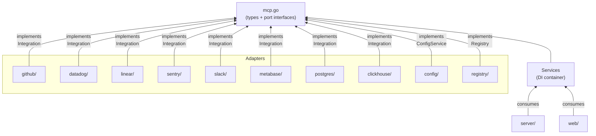

# AGENTS.md

## Overview

- Go MCP server aggregating GitHub, Datadog, Linear, Sentry, Slack, Metabase, AWS, PostHog, PostgreSQL, ClickHouse behind one endpoint
- Two meta-tools only: **search** (discover operations) and **execute** (run them)
- Hexagonal architecture (ports and adapters)
- HTTP transport (streamable) + web config UI on same port

## Commands

| Target | Command | Make shortcut |
|--------|---------|---------------|
| Build | `go build -o switchboard ./cmd/server` | `make build` |
| Test | `go test ./...` | `make test` |
| Test + race | `go test -race -coverprofile=coverage.out ./...` | `make test-race` |
| Vet | `go vet ./...` | `make vet` |
| Lint | `golangci-lint run` | `make lint` |
| Security scan | `go tool gosec -exclude=G101,G104,G115,G117,G119,G120,G304,G505,G704 ./...` | `make gosec` |
| Vuln check | `go tool govulncheck ./...` | `make govulncheck` |
| All security | gosec + govulncheck | `make security` |
| **All CI checks** | build + vet + test-race + lint + security | **`make ci`** |
| Generate templ | `go generate .` | `make generate` |
| Clean | `rm -f switchboard coverage.out` | `make clean` |

```bash
# Run (default — HTTP server with MCP + web UI on same port)
./switchboard
./switchboard --port 3847

# Run (stdio mode — legacy, for AI clients that need stdin/stdout)
./switchboard --stdio

# Daemon management
./switchboard daemon install              # Install as launchd (macOS) or systemd (Linux) service
./switchboard daemon uninstall            # Remove the system service
./switchboard daemon start                # Start the daemon (uses service if installed, else detached process)
./switchboard daemon start --port 9999    # Start on a custom port
./switchboard daemon stop                 # Stop the daemon
./switchboard daemon status               # Show daemon status + health
./switchboard daemon logs                 # Print log file path

# Release (local snapshot for testing)
goreleaser release --snapshot --clean

# Release (production — triggered by pushing a git tag)
git tag -a v0.1.0 -m "v0.1.0"
git push origin v0.1.0
# CI (or manually): goreleaser release --clean

# Generate templ templates (required after editing .templ files in web/templates/)
make generate
```

- **Templ**: `web/templates/*.templ` → run `templ generate` after edits. **Never edit `*_templ.go`** (generated)
- **Release**: GoReleaser via `.goreleaser.yml`. Ldflags: `main.version`, `main.commit`, `main.date`
- **Testing**: `stretchr/testify` assertions. Tests in every package
- **Linting**: `.golangci.yml` — errcheck, govet, ineffassign, staticcheck, unused
- **CI**: `.github/workflows/ci.yml` — build, test (race), golangci-lint, gosec, govulncheck
- **Go 1.26** — deps: `go-sdk`, `go-github/v68`, `slack-go/slack`, `a-h/templ`, `lib/pq`, `clickhouse-go/v2`, `testify`

## Requirements Before Completing Code Changes

1. **Run `make ci`** — must pass (build, vet, test-race, lint, security)
2. **New code must include tests**
3. **TDD**: write failing test before implementation, verify it fails for the right reason, then write minimal code to pass
4. **Table-driven tests**: use `t.Run` subtests when 3+ cases share the same assert structure. Keep standalone tests for cases with unique setup or assertions

## Git Workflow

- Branch from `main` for all changes
- CI runs on PRs to `main`: build, test (race detection), lint, gosec, govulncheck — all must pass
- Commit messages: descriptive subject line, imperative mood (e.g., "Add Linear OAuth flow", "Fix token refresh race condition")
- PRs should include tests for new functionality

## Commit Attribution

AI commits MUST include:
```
Co-Authored-By: <agent model name> <noreply@anthropic.com>
```

## Project Structure

```
mcp.go                       Domain types + port interfaces (the hexagonal core)
cmd/server/main.go           Composition root — wires adapters into Services, starts server + daemon subcommand
server/server.go             MCP server — exposes search/execute tools, routes to integrations
config/config.go             ConfigService adapter — JSON file at ~/.config/switchboard/config.json
registry/registry.go         Registry adapter — thread-safe integration lookup
daemon/
  daemon.go                  Daemon management — PID file, health checks, process control, status
  launchd.go                 macOS launchd plist generation + launchctl commands
  systemd.go                 Linux systemd user unit generation + systemctl commands
  fallback.go                Platform dispatch + pure Go process detach fallback
  proc_unix.go               Unix-specific SysProcAttr (Setsid)
  proc_windows.go            Windows-specific SysProcAttr (CREATE_NO_WINDOW)
github/
  github.go                  GitHub integration adapter (core, dispatch, helpers)
  tools.go                   GitHub tool definitions (~100 tools)
  repos.go                   Repos, releases, deploy keys, webhooks, rate limit handlers
  issues.go                  Issues, comments, labels, milestones handlers
  pulls.go                   Pull requests, reviews, merge handlers
  git.go                     Low-level git (commits, refs, trees, tags) handlers
  users_orgs.go              Users, followers, orgs, teams handlers
  actions.go                 Actions workflows, runs, jobs, secrets, checks handlers
  search.go                  Search (code, issues, users, commits) handlers
  extras.go                  Gists, activity, code/secret/dependabot scanning, copilot handlers
  oauth.go                   GitHub Device Flow OAuth (device code grant, polling, token exchange)
datadog/
  datadog.go                 Datadog integration adapter (core, dispatch, SDK client, helpers)
  tools.go                   Datadog tool definitions (~60 tools)
  logs.go                    Logs search and aggregation handlers
  metrics.go                 Metrics query, search, metadata handlers
  monitors.go                Monitors CRUD, search, mute handlers
  dashboards.go              Dashboards list, get, create, delete handlers
  events.go                  Events list, search, get, create handlers
  extras.go                  Hosts, tags, SLOs, downtimes, incidents, synthetics,
                             notebooks, users, spans, software catalog, IP ranges handlers
linear/
  linear.go                  Linear integration adapter (core, dispatch, GraphQL helpers)
  tools.go                   Linear tool definitions (~60 tools)
  issues.go                  Issues, comments, relations, labels, attachments handlers
  projects.go                Projects, project updates, milestones handlers
  teams.go                   Teams and users handlers
  extras.go                  Cycles, labels, workflow states, documents, initiatives,
                             favorites, webhooks, notifications, templates, org,
                             custom views, rate limit handlers
  oauth.go                   Linear OAuth (PKCE authorization code flow, token exchange)
sentry/
  sentry.go                  Sentry integration adapter (core, dispatch, HTTP helpers)
  tools.go                   Sentry tool definitions (~55 tools)
  organizations.go           Organizations, members, teams, repos handlers
  issues.go                  Projects, issues, events, tags, stats handlers
  releases.go                Releases, deploys, commits, files handlers
  extras.go                  Alerts, monitors (cron), discover, replays handlers
  oauth.go                   Sentry Device Flow OAuth (device code grant, polling)
slack/
  slack.go                   Slack integration adapter (core, dispatch, cookie transport, mutex-protected client)
  tokens.go                  Token store (persistence, Chrome disk-read extraction via LevelDB+SQLite+AES, background refresh)
  tools.go                   Slack tool definitions (~42 tools)
  conversations.go           Channels, DMs, history, threads handlers
  messages.go                Send, update, delete, search, reactions, pins handlers
  users.go                   Users, user groups, presence handlers
  extras.go                  Files, bookmarks, reminders, emoji, team info, auth handlers
  extract.go                 Exported helpers for web UI token extraction (Chrome, manual, snippet)
  oauth.go                   Slack OAuth v2 (authorization code flow, callback handling)
  refresh.go                 Cookie-based token refresh (fetches fresh xoxc via xoxd cookie HTTP request)
metabase/
  metabase.go                Metabase integration adapter (core, dispatch, HTTP helpers)
  tools.go                   Metabase tool definitions (~22 tools)
  databases.go               Database, table, field metadata handlers
  queries.go                 Native SQL query execution, card CRUD handlers
  dashboards.go              Dashboard CRUD, add-card-to-dashboard handlers
  collections.go             Collection CRUD, search handlers
aws/
  aws.go                     AWS integration adapter (core, dispatch, typed SDK clients, helpers)
  tools.go                   AWS tool definitions (~65 tools)
  sts.go                     STS caller identity handler
  s3.go                      S3 buckets, objects CRUD, copy, head handlers
  ec2.go                     EC2 instances, security groups, VPCs, subnets, volumes, addresses handlers
  lambda.go                  Lambda functions, invoke, event source mappings handlers
  iam.go                     IAM users, roles, policies, groups, attached policies handlers
  cloudwatch.go              CloudWatch metrics, metric data, alarms, statistics handlers
  ecs.go                     ECS clusters, services, tasks, task definitions handlers
  sns.go                     SNS topics, subscriptions, publish handlers
  sqs.go                     SQS queues, messages, send/receive/delete handlers
  dynamodb.go                DynamoDB tables, items CRUD, query, scan handlers
  cloudformation.go          CloudFormation stacks, resources, templates, events handlers
posthog/
  posthog.go                 PostHog integration adapter (core, dispatch, HTTP helpers)
  tools.go                   PostHog tool definitions (~50 tools)
  projects.go                Projects CRUD handlers
  feature_flags.go           Feature flags CRUD, activity handlers
  cohorts.go                 Cohorts CRUD, persons-in-cohort handlers
  insights.go                Insights (trends, funnels) CRUD handlers
  persons.go                 Persons, groups, property management handlers
  extras.go                  Annotations, dashboards, actions, events, experiments, surveys handlers
postgres/
  postgres.go                PostgreSQL integration adapter (core, dispatch, sql.DB helpers)
  tools.go                   PostgreSQL tool definitions (~25 tools)
  databases.go               Schema discovery, table/column/index/constraint/view/function/trigger/enum handlers
  queries.go                 Query execution, EXPLAIN, SELECT builder, read-only transaction wrappers
  management.go              Database info, size, stats, roles, grants, extensions, connections, locks handlers
clickhouse/
  clickhouse.go              ClickHouse integration adapter (core, dispatch, native driver helpers)
  tools.go                   ClickHouse tool definitions (~20 tools)
  queries.go                 SQL query execution, EXPLAIN handlers
  databases.go               Database, table, column metadata handlers
  extras.go                  System info, processes, merges, replicas, disk usage,
                             parts, dictionaries, users, roles, query log handlers
web/
  web.go                     Web UI HTTP server for config dashboard + Slack token setup routes
  templates/                 Templ-based templates — do not edit *_templ.go (generated)
    layouts/                 Base layout templates
    pages/                   dashboard, integrations_list, integration detail,
                             github_setup, linear_setup, sentry_setup, slack_setup
    components/              Shared UI components
```

## Architecture

### Hexagonal Pattern

The root package is `package mcp` (not `switchboard`, despite the module name). Import as:
```go
mcp "github.com/daltoniam/switchboard"
```

Defines domain types and port interfaces. Adapters satisfy interfaces. Dependencies point inward.



**Core (`mcp.go`)**:
- Types: `Config`, `Credentials`, `IntegrationConfig`, `ToolDefinition`, `ToolResult`, `HealthStatus`
- Port interfaces: `Integration`, `ConfigService`, `Registry`
- DI container: `Services` struct

**Adapters** (each implements a port interface):
- `github/`, `datadog/`, `linear/`, `sentry/`, `slack/`, `metabase/`, `aws/`, `posthog/`, `postgres/`, `clickhouse/` → `Integration`
- `config/` → `ConfigService`
- `registry/` → `Registry`
- `server/` → MCP server (consumes `Services`)
- `web/` → Web UI server (consumes `Services`)

### Search/Execute Pattern

| MCP Tool | Purpose |
|----------|---------|
| `search` | Discover tools across enabled integrations. Filter by name, integration, keyword. Returns `ToolDefinition`s |
| `execute` | Run a tool by name with arguments. Routes to correct adapter |

**Flow:**
1. `search({"query": "github issues"})` → tool definitions with parameter schemas
2. `execute({"tool_name": "github_list_issues", "arguments": {"owner": "golang", "repo": "go"}})` → results

## Key Interface: `Integration`

Every integration adapter implements this interface defined in `mcp.go`:

```go
type Integration interface {
    Name() string
    Configure(creds Credentials) error
    Tools() []ToolDefinition
    Execute(ctx context.Context, toolName string, args map[string]any) (*ToolResult, error)
    Healthy(ctx context.Context) bool
}
```

- **`Name()`** — Lowercase identifier (e.g., `"github"`). Must match config key.
- **`Configure()`** — Receives `Credentials` (`map[string]string`). Validate and store.
- **`Tools()`** — Returns tool definitions for progressive discovery via the `search` MCP tool.
- **`Execute()`** — Dispatches to the correct handler by tool name. Returns `*ToolResult`.
- **`Healthy()`** — Lightweight API call to verify credentials.

## Other Port Interfaces

```go
type ConfigService interface {
    Load() error
    Save() error
    Get() *Config
    Update(cfg *Config) error
    GetIntegration(name string) (*IntegrationConfig, bool)
    SetIntegration(name string, ic *IntegrationConfig) error
    EnabledIntegrations() []string
}

type Registry interface {
    Register(i Integration) error
    Get(name string) (Integration, bool)
    All() []Integration
    Names() []string
}
```

## Services Struct (DI Container)

```go
type Services struct {
    Config   ConfigService
    Registry Registry
}
```

Constructed in `cmd/server/main.go` and passed to both `server.New()` and `web.New()`.

## Adding a New Integration

1. Create `<name>/<name>.go` in the repo root.
2. Define an unexported struct implementing `Integration`.
3. Export a `New()` constructor that returns `mcp.Integration`.
4. In `Tools()`, return `[]mcp.ToolDefinition` describing each operation.
5. In `Execute()`, switch on tool name and dispatch to private handler methods.
6. Register in `cmd/server/main.go` by adding to the integration list.
7. Add default credentials to `config.defaultConfig()` in `config/config.go`.

## Conventions and Patterns

### Unexported Structs, Exported Constructors
```go
type github struct { ... }           // unexported
func New() mcp.Integration { ... }   // returns interface
```

### Import Aliases

Only `slack` requires an alias to avoid collision with the package name. Other packages are imported directly.

| Package | Alias | Used In |
|---------|-------|---------|
| `github.com/daltoniam/switchboard` | `mcp` | All consumers |
| `.../switchboard/slack` | `slackInt` | `cmd/server/main.go`, `web/web.go` |
| `.../switchboard/github` | `ghInt` | `web/web.go` |
| `.../switchboard/linear` | `linearInt` | `web/web.go` |
| `.../switchboard/sentry` | `sentryInt` | `web/web.go` |

### Tool Naming
Tools are prefixed with integration name: `github_search_repos`, `datadog_search_logs`, `linear_list_issues`, `sentry_list_issues`.

### Argument Parsing
Each adapter has a local `argStr` helper:
```go
func argStr(args map[string]any, key string) string {
    v, _ := args[key].(string)
    return v
}
```

### Dispatch Map Test Parity

Every adapter **must** have two tests enforcing bidirectional parity between `Tools()` definitions and the `dispatch` map:

- `TestDispatchMap_AllToolsCovered` — every tool returned by `Tools()` has a handler in `dispatch`
- `TestDispatchMap_NoOrphanHandlers` — every key in `dispatch` has a corresponding `ToolDefinition`

When adding a new tool: add both the `ToolDefinition` in `tools.go` **and** the handler entry in the `dispatch` map. Tests will fail if either is missing.

### Error Handling
- Integration errors: return `&mcp.ToolResult{Data: err.Error(), IsError: true}, nil`
- Only return a non-nil Go error for truly exceptional failures
- The server layer wraps these into MCP error results

### HTTP Client / SDK Pattern
Each adapter uses either a typed SDK or raw HTTP. Auth varies:
- **GitHub**: `google/go-github/v68` typed SDK. Auth via `oauth2` token transport.
- **Datadog**: `DataDog/datadog-api-client-go/v2` typed SDK. Auth via `context.WithValue(ctx, datadog.ContextAPIKeys, ...)`. Site via `ContextServerVariables`. SDK has V1 and V2 API packages (`datadogV1`, `datadogV2`). Incidents API requires `cfg.SetUnstableOperationEnabled("v2.XxxIncident", true)`.
- **Linear**: Hand-rolled GraphQL over `net/http`. Auth via `Authorization: <api_key>` (no Bearer prefix).
- **Sentry**: Hand-rolled REST over `net/http` (no typed Go SDK for Sentry management API — `getsentry/sentry-go` is for error capture only). Auth via `Authorization: Bearer <auth_token>`. Base URL defaults to `https://sentry.io/api/0`. Organization slug configured once and injected into paths via `org(args)` helper.
- **Slack**: `slack-go/slack` typed SDK with **session token auth** (`xoxc-*` token + `xoxd-*` cookie)
  - `cookieTransport` (`http.RoundTripper`) injects `Cookie: d=<xoxd-cookie>`
  - Token priority: (1) config, (2) `~/.slack-mcp-tokens.json`, (3) Chrome disk-read (macOS)
  - Chrome extraction: LevelDB (`xoxc-*`) + encrypted SQLite cookies (`xoxd-*`, AES-128-CBC via Keychain)
  - Background refresh every 4h (`refresh.go`). Mutex-protected client (`s.getClient()`)
  - OAuth v2 flow (`oauth.go`) for web UI setup
- **AWS**: `aws-sdk-go-v2` official typed SDK. Auth via static credentials or default credential chain. Region defaults to `us-east-1`. Each service gets typed client via `<service>.NewFromConfig(cfg)`. Import aliased as `awsInt`
- **ClickHouse**: `ClickHouse/clickhouse-go/v2` typed native driver. Auth via `ch.Auth{Username, Password}`. Supports TLS (`secure`/`skip_verify` config). Connection pooling built into driver. Dynamic column scanning via `reflect` for generic query results.

### Config
- File: `~/.config/switchboard/config.json`
- Auto-created with defaults if missing
- `Credentials` is `map[string]string`
- Thread-safe (`sync.RWMutex`)
- File permissions: dir `0700`, file `0600`

### Web UI
- Templ templates in `web/templates/` (see Commands section for generate workflow)
- Default port: 3847
- Go 1.22+ method-pattern routing (`"GET /integrations/{name}"`, `"POST /api/slack/save-tokens"`)
- Routes:
  - `GET /` — Dashboard with integration health status
  - `GET /integrations` — Integration list
  - `GET /integrations/{name}` — Integration detail + credential form
  - `POST /integrations/{name}` — Save integration credentials
- **OAuth/Setup pages** (guided credential flows):
  - `GET /integrations/github/setup` — GitHub Device Flow OAuth
  - `GET /integrations/linear/setup` — Linear OAuth (PKCE)
  - `GET /integrations/sentry/setup` — Sentry Device Flow OAuth
  - `GET /integrations/slack/setup` — Slack token extraction (Chrome auto-extract, manual browser snippet, direct entry)
- All setup pages save credentials to both the integration config and any external token files

## Local Skills

| Skill | When to use | Path |
|-------|-------------|------|
| `add-integration` | Adding a new external API integration adapter | `.claude/skills/add-integration/SKILL.md` |

## Gotchas

- **Arg helpers are duplicated** per adapter — intentional. All have `argStr`, `argInt`, `argBool`. GitHub/Datadog/AWS also have `argInt64`, `argStrSlice`
- **All ten adapters use dispatch maps** (`var dispatch map[string]handlerFunc`). Tool counts: GitHub ~100, AWS ~65, Datadog ~60, Linear ~60, Sentry ~55, PostHog ~50, Slack ~40, Postgres ~25, Metabase ~22, ClickHouse ~20
- **Linear is the only GraphQL adapter**. `gql()` helper, entity resolution (`resolveTeamID`, `resolveIssueID`), field fragment constants (`issueFields`, `projectFields`)
- **AWS adapter uses `aws-sdk-go-v2`** — 11 typed service clients (S3, EC2, Lambda, IAM, CloudWatch, STS, ECS, SNS, SQS, DynamoDB, CloudFormation). Custom `unmarshalDynamoJSON` for DynamoDB AttributeValue marshalling. S3 `GetObject` capped at 10MB via `io.LimitReader`
- **PostHog adapter uses hand-rolled REST HTTP**. ~50 tools covering projects, feature flags, cohorts, insights, persons, groups, annotations, dashboards, actions, events, experiments, and surveys. Auth via `Authorization: Bearer <api_key>` (personal API key starting with `phx_`). Base URL defaults to `https://us.posthog.com`; configurable for EU or self-hosted. Most deletes are soft deletes (PATCH with `deleted: true`).
- **PostgreSQL adapter uses `database/sql` with `lib/pq`**. ~25 tools. Auth via `connection_string` or individual host/port/user/password/database/sslmode. Read-only queries wrapped in read-only transactions. `sanitizeIdentifier` prevents SQL injection. Handlers split across `databases.go`, `queries.go`, `management.go`
- **`search` returns `ToolDefinition` metadata**, not raw API specs
