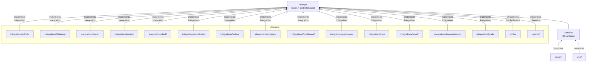

# Architecture

## Project Structure

```
mcp.go                       Domain types + port interfaces (the hexagonal core)
compact.go                   Field compaction engine — CompactJSON, ParseCompactSpecs, dot-notation parser
cmd/server/main.go           Composition root — wires adapters into Services, starts server + daemon subcommand
server/server.go             MCP server — exposes search/execute tools, routes to integrations, applies field compaction
config/config.go             ConfigService adapter — JSON file at ~/.config/switchboard/config.json
registry/registry.go         Registry adapter — thread-safe integration lookup
daemon/
  daemon.go                  Daemon management — PID file, health checks, process control, status
  launchd.go                 macOS launchd plist generation + launchctl commands
  systemd.go                 Linux systemd user unit generation + systemctl commands
  fallback.go                Platform dispatch + pure Go process detach fallback
  proc_unix.go               Unix-specific SysProcAttr (Setsid)
  proc_windows.go            Windows-specific SysProcAttr (CREATE_NO_WINDOW)
integrations/
  github/
    github.go                GitHub integration adapter (core, dispatch, helpers, FieldCompactionIntegration)
    compact_specs.go         Field compaction spec declarations (~45 list/search tools)
    tools.go                 GitHub tool definitions (~100 tools)
    repos.go                 Repos, releases, deploy keys, webhooks, rate limit handlers
    issues.go                Issues, comments, labels, milestones handlers
    pulls.go                 Pull requests, reviews, merge handlers
    git.go                   Low-level git (commits, refs, trees, tags) handlers
    users_orgs.go            Users, followers, orgs, teams handlers
    actions.go               Actions workflows, runs, jobs, secrets, checks handlers
    search.go                Search (code, issues, users, commits) handlers
    extras.go                Gists, activity, code/secret/dependabot scanning, copilot handlers
    oauth.go                 GitHub Device Flow OAuth (device code grant, polling, token exchange)
  datadog/
    datadog.go               Datadog integration adapter (core, dispatch, SDK client, helpers)
    tools.go                 Datadog tool definitions (~60 tools)
    logs.go                  Logs search and aggregation handlers
    metrics.go               Metrics query, search, metadata handlers
    monitors.go              Monitors CRUD, search, mute handlers
    dashboards.go            Dashboards list, get, create, delete handlers
    events.go                Events list, search, get, create handlers
    extras.go                Hosts, tags, SLOs, downtimes, incidents, synthetics,
                             notebooks, users, spans, software catalog, IP ranges handlers
  linear/
    linear.go                Linear integration adapter (core, dispatch, GraphQL helpers)
    tools.go                 Linear tool definitions (~60 tools)
    issues.go                Issues, comments, relations, labels, attachments handlers
    projects.go              Projects, project updates, milestones handlers
    teams.go                 Teams and users handlers
    extras.go                Cycles, labels, workflow states, documents, initiatives,
                             favorites, webhooks, notifications, templates, org,
                             custom views, rate limit handlers
    oauth.go                 Linear OAuth (PKCE authorization code flow, token exchange)
  sentry/
    sentry.go                Sentry integration adapter (core, dispatch, HTTP helpers)
    tools.go                 Sentry tool definitions (~55 tools)
    organizations.go         Organizations, members, teams, repos handlers
    issues.go                Projects, issues, events, tags, stats handlers
    releases.go              Releases, deploys, commits, files handlers
    extras.go                Alerts, monitors (cron), discover, replays handlers
    oauth.go                 Sentry Device Flow OAuth (device code grant, polling)
  slack/
    slack.go                 Slack integration adapter (core, dispatch, cookie transport, mutex-protected client)
    tokens.go                Token store (persistence, Chrome disk-read extraction via LevelDB+SQLite+AES, background refresh)
    tools.go                 Slack tool definitions (~42 tools)
    conversations.go         Channels, DMs, history, threads handlers
    messages.go              Send, update, delete, search, reactions, pins handlers
    users.go                 Users, user groups, presence handlers
    extras.go                Files, bookmarks, reminders, emoji, team info, auth handlers
    extract.go               Exported helpers for web UI token extraction (Chrome, manual, snippet)
    oauth.go                 Slack OAuth v2 (authorization code flow, callback handling)
    refresh.go               Cookie-based token refresh (fetches fresh xoxc via xoxd cookie HTTP request)
  metabase/
    metabase.go              Metabase integration adapter (core, dispatch, HTTP helpers)
    tools.go                 Metabase tool definitions (~22 tools)
    databases.go             Database, table, field metadata handlers
    queries.go               Native SQL query execution, card CRUD handlers
    dashboards.go            Dashboard CRUD, add-card-to-dashboard handlers
    collections.go           Collection CRUD, search handlers
  notion/
    notion.go                Notion v3 integration adapter (core, dispatch, HTTP helpers)
    tools.go                 Notion tool definitions (~24 tools)
    compact_specs.go         Field compaction spec declarations (13 read tools)
    data_sources.go          Database create, data sources read/update/query/templates handlers
    pages.go                 Pages CRUD, move, property + convenience (getPageContent, createPageWithContent) handlers
    blocks.go                Blocks CRUD, children list/append handlers
    search.go                Search handler (normalized results + recordMap merge)
    users.go                 Users list, retrieve, get-self handlers
    comments.go              Comments create, retrieve handlers
    recordmap.go             recordMap extraction helpers (extractRecord, extractAllRecords)
    transaction.go           submitTransaction builder helpers (buildOp, buildTransaction)
  aws/
    aws.go                   AWS integration adapter (core, dispatch, typed SDK clients, helpers)
    tools.go                 AWS tool definitions (~65 tools)
    sts.go                   STS caller identity handler
    s3.go                    S3 buckets, objects CRUD, copy, head handlers
    ec2.go                   EC2 instances, security groups, VPCs, subnets, volumes, addresses handlers
    lambda.go                Lambda functions, invoke, event source mappings handlers
    iam.go                   IAM users, roles, policies, groups, attached policies handlers
    cloudwatch.go            CloudWatch metrics, metric data, alarms, statistics handlers
    ecs.go                   ECS clusters, services, tasks, task definitions handlers
    sns.go                   SNS topics, subscriptions, publish handlers
    sqs.go                   SQS queues, messages, send/receive/delete handlers
    dynamodb.go              DynamoDB tables, items CRUD, query, scan handlers
    cloudformation.go        CloudFormation stacks, resources, templates, events handlers
  posthog/
    posthog.go               PostHog integration adapter (core, dispatch, HTTP helpers)
    tools.go                 PostHog tool definitions (~50 tools)
    projects.go              Projects CRUD handlers
    feature_flags.go         Feature flags CRUD, activity handlers
    cohorts.go               Cohorts CRUD, persons-in-cohort handlers
    insights.go              Insights (trends, funnels) CRUD handlers
    persons.go               Persons, groups, property management handlers
    extras.go                Annotations, dashboards, actions, events, experiments, surveys handlers
  postgres/
    postgres.go              PostgreSQL integration adapter (core, dispatch, sql.DB helpers)
    tools.go                 PostgreSQL tool definitions (~25 tools)
    databases.go             Schema discovery, table/column/index/constraint/view/function/trigger/enum handlers
    queries.go               Query execution, EXPLAIN, SELECT builder, read-only transaction wrappers
    management.go            Database info, size, stats, roles, grants, extensions, connections, locks handlers
  clickhouse/
    clickhouse.go            ClickHouse integration adapter (core, dispatch, native driver helpers)
    tools.go                 ClickHouse tool definitions (~20 tools)
    queries.go               SQL query execution, EXPLAIN handlers
    databases.go             Database, table, column metadata handlers
    extras.go                System info, processes, merges, replicas, disk usage,
                             parts, dictionaries, users, roles, query log handlers
  pganalyze/
    pganalyze.go             pganalyze integration adapter (core, dispatch, GraphQL helpers)
    compact_specs.go         Field compaction spec declarations
    tools.go                 pganalyze tool definitions (~3 tools)
    servers.go               Server listing handler
    issues.go                Issue listing handler
    queries.go               Query statistics handler
  rwx/
    rwx.go                   RWX integration adapter (core, dispatch, HTTP helpers, proxy client)
    tools.go                 RWX tool definitions (~11 tools + dynamic proxy tools)
    runs.go                  CI run listing and detail handlers
    logs.go                  Run log retrieval and caching handlers
    extras.go                Workspaces, branches, suites handlers
    proxy.go                 Proxy client for rwx mcp serve (dynamic tool forwarding)
  gmail/
    gmail.go                 Gmail integration adapter (core, dispatch, HTTP helpers, OAuth2 refresh)
    compact_specs.go         Field compaction spec declarations (~9 list tools)
    tools.go                 Gmail tool definitions (~44 tools)
    messages.go              Message CRUD, send, trash, labels handlers
    threads.go               Thread list, get, trash, labels handlers
    labels.go                Label CRUD handlers
    drafts.go                Draft CRUD, send handlers
    settings.go              Filters, forwarding, send-as, delegates, vacation handlers
    oauth.go                 Gmail OAuth2 (authorization code flow, token refresh)
  homeassistant/
    homeassistant.go         Home Assistant integration adapter (core, dispatch, HTTP helpers)
    compact_specs.go         Field compaction spec declarations
    tools.go                 Home Assistant tool definitions (~17 tools)
    states.go                Entity state listing and detail handlers
    services.go              Service domain and call handlers
    history.go               Entity history handlers
    events.go                Event firing and listening handlers
    extras.go                Config, areas, devices, entities, templates, logs handlers
  ynab/
    ynab.go                  YNAB integration adapter (core, dispatch, HTTP helpers, FieldCompactionIntegration)
    compact_specs.go         Field compaction spec declarations (~10 list tools)
    tools.go                 YNAB tool definitions (~25 tools)
    budgets.go               User, budgets, budget settings, accounts handlers
    categories.go            Categories, payees, months handlers
    transactions.go          Transactions, scheduled transactions handlers
gcp/
  gcp.go                     GCP integration adapter (core, dispatch, typed SDK clients, helpers)
  tools.go                   GCP tool definitions (~55 tools)
  resourcemanager.go         Projects, folders, IAM policy handlers
  storage.go                 Cloud Storage buckets, objects CRUD, copy handlers
  compute.go                 Compute Engine instances, disks, networks, subnetworks, firewalls handlers
  functions.go               Cloud Functions list, get, IAM policy handlers
  iam.go                     IAM service accounts, keys, roles handlers
  monitoring.go              Cloud Monitoring metrics, time series, alert policies handlers
  run.go                     Cloud Run services, revisions handlers
  pubsub.go                  Pub/Sub topics, subscriptions, publish, pull handlers
  firestore.go               Firestore collections, documents CRUD, query handlers
  logging.go                 Cloud Logging entries, log names, sinks handlers
web/
  web.go                     Web UI HTTP server for config dashboard + Slack token setup routes
  templates/                 Templ-based templates — do not edit *_templ.go (generated)
    layouts/                 Base layout templates
    pages/                   dashboard, integrations_list, integration detail,
                             github_setup, linear_setup, sentry_setup, slack_setup, notion_setup
    components/              Shared UI components
```

## Hexagonal Pattern

The root package is `package mcp` (not `switchboard`, despite the module name). Import as:
```go
mcp "github.com/daltoniam/switchboard"
```

Defines domain types and port interfaces. Adapters satisfy interfaces. Dependencies point inward.



**Core (`mcp.go` + `compact.go`)**:
- Types: `Config`, `Credentials`, `IntegrationConfig`, `ToolDefinition`, `ToolResult`, `HealthStatus`, `CompactField`
- Port interfaces: `Integration`, `ConfigService`, `Registry`
- Opt-in interface: `FieldCompactionIntegration` — adapters implement to declare field compaction specs
- DI container: `Services` struct

**Adapters** (each implements a port interface):
- `integrations/github/`, `integrations/datadog/`, `integrations/linear/`, `integrations/sentry/`, `integrations/slack/`, `integrations/metabase/`, `integrations/notion/`, `integrations/aws/`, `integrations/posthog/`, `integrations/postgres/`, `integrations/clickhouse/`, `integrations/pganalyze/`, `integrations/rwx/`, `integrations/gmail/`, `integrations/homeassistant/`, `integrations/ynab/`, `gcp/` → `Integration`
- `config/` → `ConfigService`
- `registry/` → `Registry`
- `server/` → MCP server (consumes `Services`)
- `web/` → Web UI server (consumes `Services`)

## Search/Execute Pattern

| MCP Tool | Purpose |
|----------|---------|
| `search` | Discover tools across enabled integrations. Filter by name, integration, keyword. Returns `ToolDefinition`s |
| `execute` | Run a tool by name with arguments. Routes to correct adapter |

**Flow:**
1. `search({"query": "github issues"})` → tool definitions with parameter schemas
2. `execute({"tool_name": "github_list_issues", "arguments": {"owner": "golang", "repo": "go"}})` → results

## Key Interface: `Integration`

Every integration adapter implements this interface defined in `mcp.go`:

```go
type Integration interface {
    Name() string
    Configure(ctx context.Context, creds Credentials) error
    Tools() []ToolDefinition
    Execute(ctx context.Context, toolName string, args map[string]any) (*ToolResult, error)
    Healthy(ctx context.Context) bool
}
```

- **`Name()`** — Lowercase identifier (e.g., `"github"`). Must match config key.
- **`Configure(ctx)`** — Receives `context.Context` and `Credentials` (`map[string]string`). Validate and store. I/O adapters propagate ctx.
- **`Tools()`** — Returns tool definitions for progressive discovery via the `search` MCP tool.
- **`Execute()`** — Dispatches to the correct handler by tool name. Returns `*ToolResult`.
- **`Healthy()`** — Lightweight API call to verify credentials.

## Other Port Interfaces

```go
type ConfigService interface {
    Load() error
    Save() error
    Get() *Config
    Update(cfg *Config) error
    GetIntegration(name string) (*IntegrationConfig, bool)
    SetIntegration(name string, ic *IntegrationConfig) error
    EnabledIntegrations() []string
}

type Registry interface {
    Register(i Integration) error
    Get(name string) (Integration, bool)
    All() []Integration
    Names() []string
}
```

## Services Struct (DI Container)

```go
type Services struct {
    Config   ConfigService
    Registry Registry
}
```

Constructed in `cmd/server/main.go` and passed to both `server.New()` and `web.New()`.

## Adding a New Integration

1. Create `integrations/<name>/<name>.go`.
2. Define an unexported struct implementing `Integration`.
3. Export a `New()` constructor that returns `mcp.Integration`.
4. In `Tools()`, return `[]mcp.ToolDefinition` describing each operation.
5. In `Execute()`, add the tool name to the `dispatch` map and implement the handler method.
6. Add `TestDispatchMap_AllToolsCovered` and `TestDispatchMap_NoOrphanHandlers` tests (see any existing adapter for the pattern). These enforce bidirectional parity between `Tools()` and the `dispatch` map.
7. If the integration has read tools, create `compact_specs.go` and `compact_specs_test.go` with parity + shape tests (see [docs/adapter-reference.md](adapter-reference.md) for the full pattern).
8. Register in `cmd/server/main.go` by adding to the integration list.
9. Add default credentials to `config.defaultConfig()` in `config/config.go`.
10. Add env var mappings for the new integration's credentials to `envMapping` in `config/config.go`.
11. Update the **Environment Variables** table in `README.md` with the new env var names.
