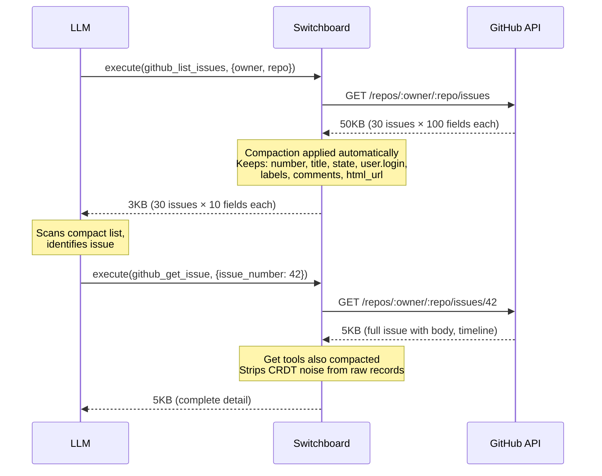

# Field Compaction

A whitelist of fields, per tool, that the MCP server uses to build a DTO before sending to the MCP client. Optimize specs for fewest total tokens across the entire task workflow, not smallest single response.

- **Opt in**: Implement `CompactSpec(toolName string) ([]CompactField, bool)` — returns parsed fields + found flag
- **Declare specs** in `<adapter>/compact_specs.go` using dot-notation: `"title"`, `"user.login"`, `"labels[].name"`, `"page.id"` (2+ specs sharing a root → nested object)
- **Spec syntax** (all parsed by `ParseCompactSpecs` in `compact.go`):
  - `"field"` — keep a top-level field
  - `"parent.child"` — extract nested value (2+ children sharing a root → nested object in output)
  - `"parent[].child"` — extract from array elements
  - `"-field"` — exclude a top-level field (exclusion mode: all other fields kept)
  - `"-parent.child"` — exclude the entire parent object
  - `"field:alias"` — rename field in output
  - `"parent.*"` — wildcard, keeps entire sub-object under parent key (one level only)
- **Omitempty**: null values and empty objects `{}` are stripped from compacted output. Empty arrays `[]` in spec-targeted array groups are preserved — a spec targeting `matches[]` means `[]` is a meaningful "0 results" signal, not noise
- **Pre-computed field plans**: `buildFieldPlan` groups specs into scalars, array groups, object groups, wildcards, and excludes once per `CompactJSON` call — shared across all array items
- **Keep**: fields that prevent N+1 drill-downs (routing fields, identifiers, states, dates, counts)
- **Drop**: nested full objects (user, repo), permissions, avatars, node_ids, template URLs
- **Compact all reads**: any tool returning raw API records (list, search, or single-record get) needs a compaction spec. Mutation tools return small confirmation objects (`{"id":"...","status":"updated"}`) — no spec needed.
- **Handler boundary**: handlers do structural transformation only (unwrap envelopes, merge split responses, tree-build). All noise/context reduction flows through compaction specs — handler-level field whitelists or record filtering cause spec drift (changes require two-file edits, reviewers miss the handler's hidden filter).
- **Dispatch parity**: `TestFieldCompactionSpecs_NoOrphanSpecs` — every spec key must have a dispatch handler
- **Shape parity**: spec paths must match the handler's actual output structure, not the assumed upstream API structure. A spec targeting `messages.matches[]` when the handler returns flat `{"matches": [...]}` extracts nothing → `{}`. Verify: trace each spec root key to the handler's `jsonResult()` / `rawResult()` call — every spec root must exist as a key in the handler output
- **GraphQL envelope awareness**: GraphQL handlers return `{"queryName": {"nodes": [...]}}` via `rawResult(gqlResp.Data)`. Specs must include the envelope path: `"issues.nodes[].id"`, not `"id"`
- **Compaction spec tests**: every adapter with `compact_specs.go` has a `compact_specs_test.go` with 7-8 tests: no orphan specs, no missing specs for read tools, no specs on mutation tools, spec parsability, nested object grouping, wildcard consistency, **shape parity** (compaction of a representative handler output produces non-empty result)
- **Unwrap SDK lists**: return `resp.Items` not `resp` so compaction operates on the array directly
- **Anti-pattern**: `return jsonResult(fullSDKWrapper)` for list tools
- **Benchmarks**: `BenchmarkCompactionRatio` in `compact_test.go` — 8 sub-benchmarks with realistic payloads (GitHub, Datadog, Linear, Sentry, AWS, exclusion, single object, passthrough). Reports input_bytes, output_bytes, savings_%, throughput MB/s.
- **Glob exclusion specs**: `"-*_url"` removes all fields matching the glob pattern. Only valid in exclusion mode (prefix `-`). Uses `path.Match` semantics. Validated at parse time — invalid patterns (e.g., `"-[invalid"`) rejected by `ParseCompactSpecs`. **Caveat**: glob catches future fields too — `"-*_url"` will silently exclude any new `*_url` field an upstream API adds. Use targeted exclusions when the field set is small and stable.
- See `.agents/skills/optimize-integration/SKILL.md` for compaction refinement, handler boundary rules, and anti-patterns

## Tool Description Design

Tool descriptions are the only context an LLM gets for tool selection. Design for correct routing:

- **Workflow entry points**: "Start here for most workflows"
- **Prefer-over hints**: "Preferred over retrieve_page — returns the full page tree"
- **Gotcha prevention**: surface ID/parameter confusion in description AND parameter strings
- **Tiers**: high-value tools get routing hints, supporting tools get chaining hints, subsumed primitives get prefer-over hints
- See `.agents/skills/optimize-integration/SKILL.md` for the full optimization workflow
