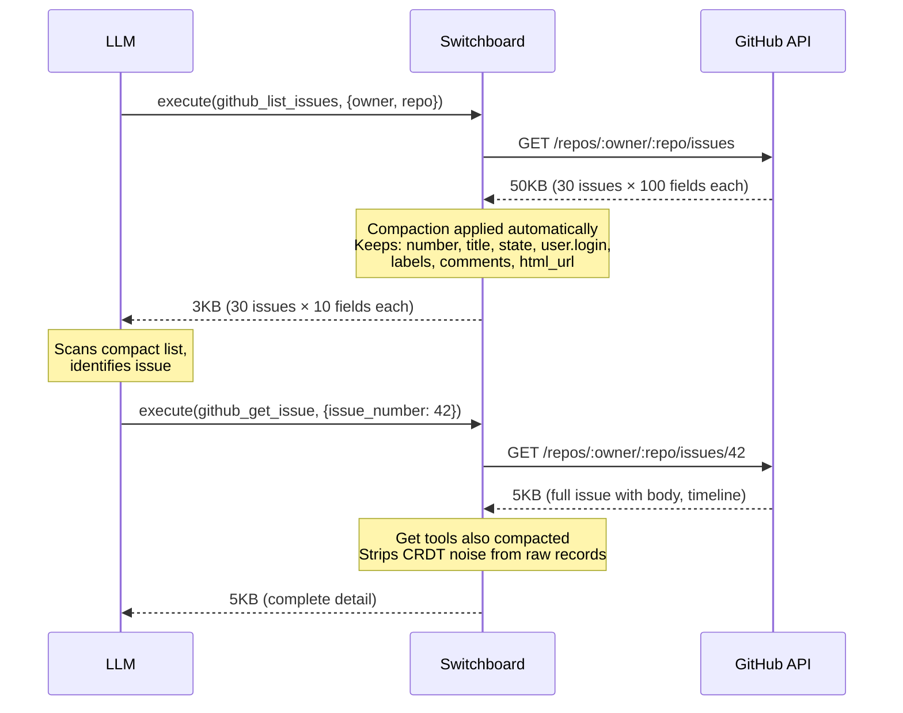

# Field Compaction

A whitelist of fields, per tool, that the MCP server uses to build a DTO before sending to the MCP client. Optimize specs for fewest total tokens across the entire task workflow, not smallest single response.



- **Whitelist, not blacklist**: a spec lists the fields you want to keep; everything else is stripped. The only blacklist-style escape hatch is `-field` for explicit exclusions within a kept parent.
- **Opt in**: implement `CompactSpec(toolName ToolName) ([]CompactField, bool)` — returns parsed fields + found flag. To declare a per-tool response size cap, also implement `MaxBytes(toolName ToolName) (int, bool)`.
- **Declare specs** in `<adapter>/compact.yaml`. The file is embedded into the binary via `//go:embed` and parsed once at adapter init by the shared `compact` package. Schema:

  ```yaml
  version: 1
  tools:
    <tool_name>:
      spec:
        - <dot-notation path>
        - <another path>
      max_bytes: 100000   # optional per-tool response size cap
  ```

  Dot-notation: `"title"`, `"user.login"`, `"labels[].name"`, `"page.id"` (2+ specs sharing a root → nested object).
- **Spec syntax** (all parsed by `ParseCompactSpecs` in `compact.go`):
  - `"field"` — keep a top-level field
  - `"parent.child"` — extract nested value (2+ children sharing a root → nested object in output)
  - `"parent[].child"` — extract from array elements
  - `"-field"` — exclude a top-level field (exclusion mode: all other fields kept)
  - `"-parent.child"` — exclude the entire parent object
  - `"field:alias"` — rename field in output
  - `"parent.*"` — wildcard, keeps entire sub-object under parent key (one level only)
- **Omitempty**: null values and empty objects `{}` are stripped from compacted output. Empty arrays `[]` in spec-targeted array groups are preserved — a spec targeting `matches[]` means `[]` is a meaningful "0 results" signal, not noise
- **Pre-computed field plans**: `buildFieldPlan` groups specs into scalars, array groups, object groups, wildcards, and excludes once per `CompactAny` call — shared across all array items
- **Keep**: fields that prevent N+1 drill-downs (routing fields, identifiers, states, dates, counts)
- **Drop**: nested full objects (user, repo), permissions, avatars, node_ids, template URLs
- **Compact all reads**: any tool returning raw API records (list, search, or single-record get) needs a compaction spec. Mutation tools return small confirmation objects (`{"id":"...","status":"updated"}`) — no spec needed.
- **Handler boundary**: handlers do structural transformation only (unwrap envelopes, merge split responses, tree-build). All noise/context reduction flows through compaction specs — handler-level field whitelists or record filtering cause spec drift (changes require two-file edits, reviewers miss the handler's hidden filter).
- **Dispatch parity**: `TestFieldCompactionSpecs_NoOrphanSpecs` — every spec key must have a dispatch handler
- **Shape parity**: spec paths must match the handler's actual output structure, not the assumed upstream API structure. A spec targeting `messages.matches[]` when the handler returns flat `{"matches": [...]}` extracts nothing → `{}`. Verify: trace each spec root key to the handler's `JSONResult()` / `RawResult()` call — every spec root must exist as a key in the handler output
- **GraphQL envelope awareness**: GraphQL handlers return `{"queryName": {"nodes": [...]}}` via `RawResult(gqlResp.Data)`. Specs must include the envelope path: `"issues.nodes[].id"`, not `"id"`
- **Compaction spec tests**: every adapter with `compact.yaml` has a `compact_specs_test.go` with 7-8 tests: no orphan specs, no missing specs for read tools, no specs on mutation tools, spec parsability, nested object grouping, wildcard consistency, **shape parity** (compaction of a representative handler output produces non-empty result). The cross-adapter strict-mode test in `compact/all_adapters_test.go` is the CI gate that catches malformed YAML before merge.
- **Unwrap SDK lists**: return `resp.Items` not `resp` so compaction operates on the array directly
- **Anti-pattern**: `return JSONResult(fullSDKWrapper)` for list tools
- **Benchmarks**: `BenchmarkCompactionRatio` in `compact_test.go` — 8 sub-benchmarks with realistic payloads (GitHub, Datadog, Linear, Sentry, AWS, exclusion, single object, passthrough). Reports input_bytes, output_bytes, savings_%, throughput MB/s.
- **Glob exclusion specs**: `"-*_url"` removes all fields matching the glob pattern. Only valid in exclusion mode (prefix `-`). Uses `path.Match` semantics. Validated at parse time — invalid patterns (e.g., `"-[invalid"`) rejected by `ParseCompactSpecs`. **Caveat**: glob catches future fields too — `"-*_url"` will silently exclude any new `*_url` field an upstream API adds. Use targeted exclusions when the field set is small and stable.
- See `.agents/skills/optimize-integration/SKILL.md` for compaction refinement, handler boundary rules, and anti-patterns

## Runtime Posture: Lenient at Runtime, Strict in Tests

The YAML loader runs in two modes. At runtime, an invalid spec entry is skipped and logged; the affected tool returns its raw JSON unchanged, and every other tool keeps working. In tests, the same entry is a hard failure — `compact/all_adapters_test.go` walks every adapter's YAML in strict mode so a bad spec lands on CI, not in production.

The reason for the split: production should keep responding even when a single spec rots after an upstream API rename. The CI gate makes sure that rot is caught the moment a developer pushes the broken file.

## Adapting to Upstream API Drift

Embedded YAML files are the defaults the binary ships with. When an upstream API changes — a field gets renamed, a useful new field appears, a once-noisy field becomes important — you can patch the spec without rebuilding Switchboard:

1. Set `SWITCHBOARD_COMPACT_DIR` to a directory you control.
2. Drop `<adapter>.yaml` in that directory. The file can be the whole adapter copied out of the source tree, or a partial file containing only the tools you want to change.
3. Restart Switchboard.

Merge is per-tool: tools defined in the override replace the embedded value; tools you don't mention fall through to the embedded defaults. A tool that exists only in your override (no embedded counterpart) is loaded with a startup warning — usually a sign of a typo.

## Per-Tool Response Size Cap (`max_bytes`)

Optional. When a tool's `max_bytes` is set and the post-compaction response exceeds it, the server replaces the body with a structured error:

```json
{
  "error": "response_too_large",
  "tool": "<tool_name>",
  "size": <actual bytes>,
  "limit": <max_bytes>,
  "hint": "narrow your query (e.g., add a filter, reduce page size, or request fewer fields)"
}
```

The shape matters: it's valid JSON the LLM can parse and react to. A naïve truncation would corrupt the document and leave the LLM guessing what failed. This envelope tells it exactly what to do next.

Distinguish this from the integration-wide cap (`MaxResponseBytesIntegration`, a single number for the whole adapter). The per-tool cap is finer-grained and returns a richer error; the integration-wide cap is the broader safety net. Both coexist — a tool that triggers its per-tool cap returns the envelope (small), and the integration-wide check then passes.

## Multiple Views Per Tool

Some tools return very different amounts depending on what the caller wants. A page in Notion can be a one-line title or a 50KB block tree. A single compaction spec forces a choice: small and the caller can't read content, large and every nav call burns context.

Views fix that. One tool, several specs, one default.

```yaml
notion_get_page_content:
  views:
    toc:
      spec:
        - page.id
        - page.properties
        - blocks[].id
        - blocks[].type
        - blocks[].properties
      hint: "Page title + section headers (~1KB). Use for navigation."
      formats: [json]
    full:
      spec:
        - page.*
        - blocks[].*
      hint: "Entire block tree (can be 10-50KB). Use when you need page content."
      formats: [json, markdown]
  default:
    view: toc
    format: json
```

The default view is the one the LLM gets when it doesn't ask for anything specific. Pick the smallest useful shape — under-fetching is one extra call, over-fetching is wasted context every call.

The caller switches views with an argument: `{"page_id": "abc", "view": "full"}`. Same tool, different projection. Unknown view names return a structured error envelope listing the available views — never a silent fallback to a different shape than what was asked.

### How the LLM Discovers Other Views

The response itself tells the caller what else exists. After projection, if the chosen view isn't the only one, the server appends a `_more` envelope:

```json
{
  "page": { "id": "abc", "properties": {...} },
  "blocks": [...],
  "_more": {
    "views": {
      "full": "Entire block tree (can be 10-50KB). Use when you need page content."
    }
  }
}
```

That's the hint text from the YAML, surfaced at the exact moment the LLM might want it. The tool description stays clean — no `Views: toc | full` bloat, no instructions to memorize. The affordance is learned by doing.

Array-rooted responses wrap to `{data: [...], _more: {...}}`. Single-view tools skip the envelope entirely.

### Formats

A view declares which formats it can render in. JSON is the framework default. Markdown is also a framework default — for object-shaped responses the server walks the projected value and produces definition lists, tables for arrays-of-objects, and bullet lists for slices.

When the generic formatter isn't good enough for a particular tool — Notion's full block tree, for instance, needs a nested-heading layout the generic formatter can't produce — the adapter registers a custom renderer:

```go
var compactRenderers = map[compact.RenderKey]compact.Renderer{
    {Tool: "notion_get_page_content", View: "full", Format: compact.FormatMarkdown}: renderFullPageContentMD,
}

var compactResult = compact.MustLoadWithOverlay("notion", compactYAML, compact.Options{
    Strict:    false,
    Renderers: compactRenderers,
})
```

The loader resolves every declared `(view, format)` combo to a concrete renderer at startup. If a YAML declares `formats: [json, markdown]` but provides no markdown renderer and the framework default doesn't apply, strict mode fails at load. The integration's job is to provide a renderer for every combo it declares; the loader's job is to prove every declared combo has one.

### Why a Strict Contract

The YAML is what the LLM gets to use. If a view declares `formats: [json]` and the caller asks for markdown, the server returns an error envelope, not a JSON response with a markdown wrapper or vice versa. Silent fallback is the worst outcome — the LLM thinks it asked for one thing and got something close but different, and has no way to know.

Unsupported combos look like this:

```json
{
  "error": "view_dispatch_failed",
  "tool": "notion_get_page_content",
  "message": "view \"toc\" does not declare format \"markdown\" (available formats: json)"
}
```

Unknown view names follow the same shape with a different message: `unknown view "summary" (available: toc, full)`. The shape matters — it's parseable, names what was asked, and the message lists what's available. The LLM can recover on the next call.

### When to Use Views vs. Splitting Tools

Views are right when one underlying operation can produce several useful projections of the same data. A page is a page — TOC and full body are different shapes of one fetch.

Splitting into separate tools is right when the operations themselves differ — `notion_search` and `notion_query_data_source` are not views of one tool, they hit different endpoints.

Rule of thumb: if the handler code would be identical, it's a view. If you'd write two handlers, write two tools.

## Tool Description Design

Tool descriptions are the only context an LLM gets for tool selection. Design for correct routing:

- **Workflow entry points**: "Start here for most workflows"
- **Prefer-over hints**: "Preferred over retrieve_page — returns the full page tree"
- **Gotcha prevention**: surface ID/parameter confusion in description AND parameter strings
- **Tiers**: high-value tools get routing hints, supporting tools get chaining hints, subsumed primitives get prefer-over hints
- See `.agents/skills/optimize-integration/SKILL.md` for the full optimization workflow
